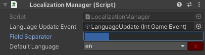

# Simple Localization

A simple tool for localization.

## Description

A simple tool to load localized resource and trigger event based on it.



## Usage

1. Put the LocalizationManager prefab on your scene. Beware that it loads the default file on Awake, so better not put it on the first scene.
2. Use the LocalizeText aside a Text component for it to be updated with the correct text, or use GetString on the manager to get a localized string.

```C#
LocalizationManager.GetString("game.title");
```

### Set language

You can manually switch the used language (and loads it resource) by calling SetLanguage with the index matching the content of the "sl-language-list.txt" file located under the Resource folder.

```C#
LocalizationManager.SetLanguage(1);
```

### Be notified on language change

Use the *LanguageUpdateEvent* game event to be notified when the language change. This event passes the language index to it.
If you need the name of the current language, you can do so by calling CurrentLanguageName on the LocalizationManager.

## Demo

A demo is present in the [GameQuest](https://github.com/FredericRP/GameQuest) asset.
